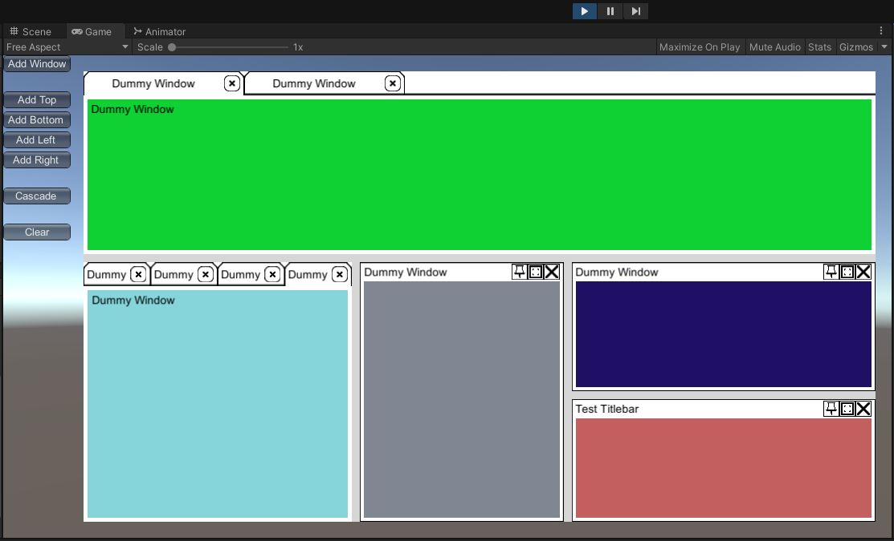

# UIDock

UIDock is a library to create advanced user interface windows in Unity3D. These 
interfaces allow for floating windows, drag-and-drop docking, sash resizing, and 
notebook tabs - similar to many advanced IDEs and other types of editors.

# Explanation

Below is a link to a basic explanation of how the datastructures are managed
to create the advanced UI functionality.
https://pixeleuphoria.com/blog/index.php/notes-on-docking-splitter-auis/

# How To Use

To use, add the Root object to a GameObject under the UI Canvas of a project. The
Root script derives off the UI image so the GameObject cannot have any UI Graphics
inside of it. Then assign it a Props member value - see the section below for more
information on Props.

The scene SampleScene shows a simple demo of how to use. See the script Test.cs for
its implementation.

# How To Modify

Assigned of different layout variables and assets is done in a DockProps file. It 
is a scriptable object that can be created from Assets>Create>PxPre>DockProps. There 
is already a sample DockProps with test sprites included in the folder SampleProp.

In order to use a DockProp, they need to be assigned to a Root's Prop variable in
the inspector.

# License

MIT License

Copyright (c) 2021 Pixel Precision, LLC

Permission is hereby granted, free of charge, to any person obtaining a copy
of this software and associated documentation files (the "Software"), to deal
in the Software without restriction, including without limitation the rights
to use, copy, modify, merge, publish, distribute, sublicense, and/or sell
copies of the Software, and to permit persons to whom the Software is
furnished to do so, subject to the following conditions:

The above copyright notice and this permission notice shall be included in all
copies or substantial portions of the Software.

THE SOFTWARE IS PROVIDED "AS IS", WITHOUT WARRANTY OF ANY KIND, EXPRESS OR
IMPLIED, INCLUDING BUT NOT LIMITED TO THE WARRANTIES OF MERCHANTABILITY,
FITNESS FOR A PARTICULAR PURPOSE AND NONINFRINGEMENT. IN NO EVENT SHALL THE
AUTHORS OR COPYRIGHT HOLDERS BE LIABLE FOR ANY CLAIM, DAMAGES OR OTHER
LIABILITY, WHETHER IN AN ACTION OF CONTRACT, TORT OR OTHERWISE, ARISING FROM,
OUT OF OR IN CONNECTION WITH THE SOFTWARE OR THE USE OR OTHER DEALINGS IN THE
SOFTWARE.